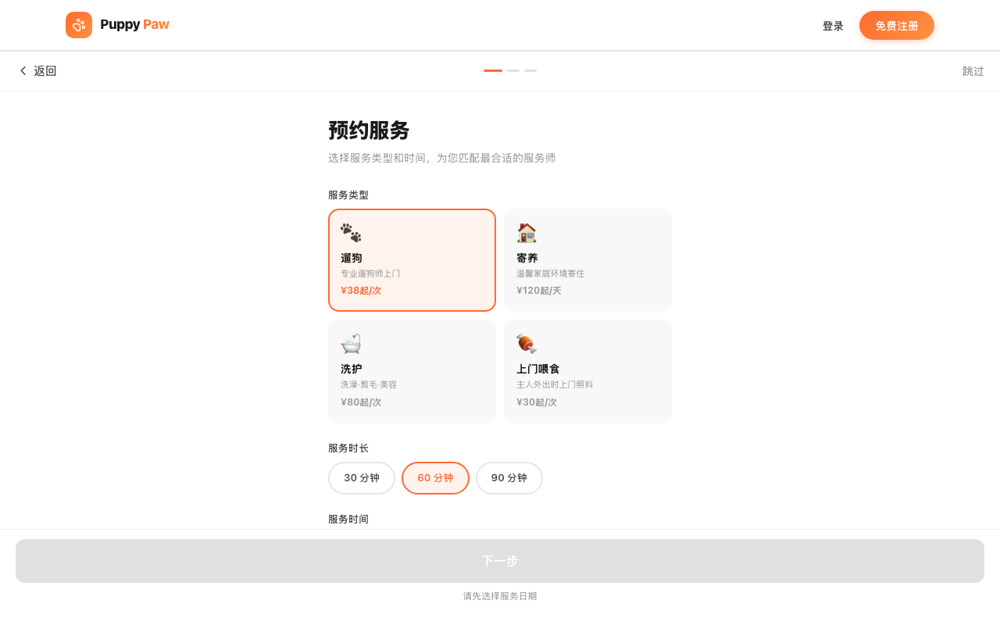
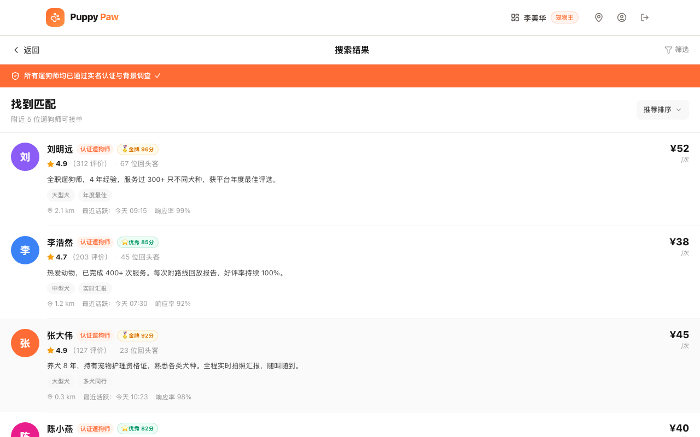
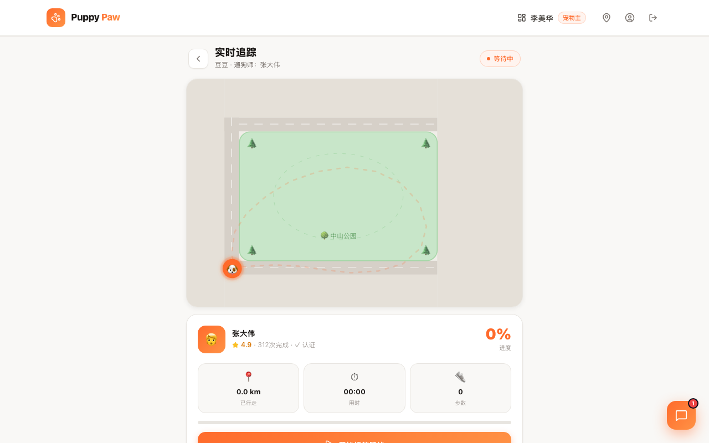
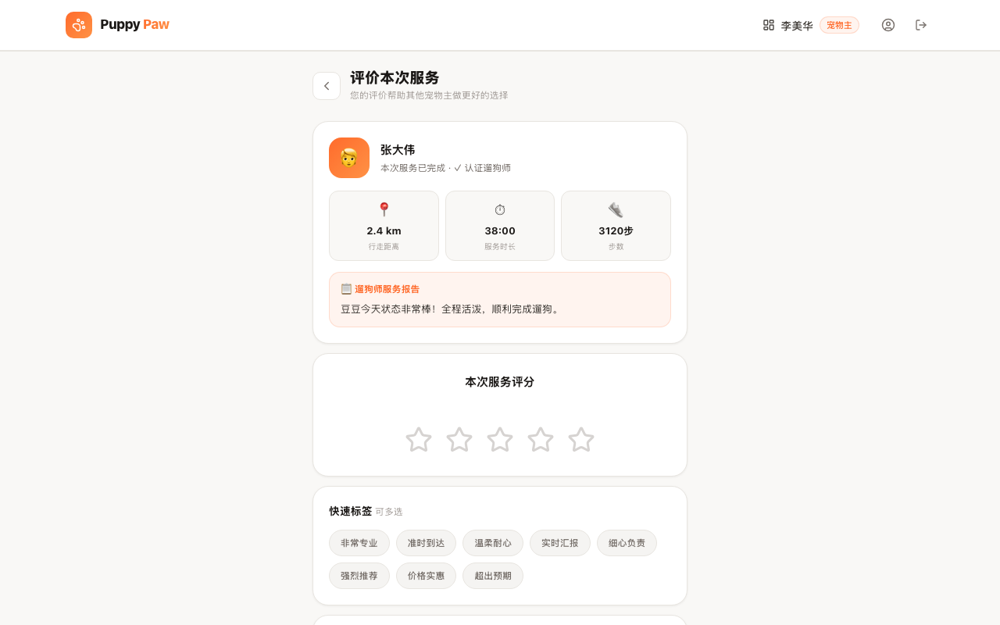
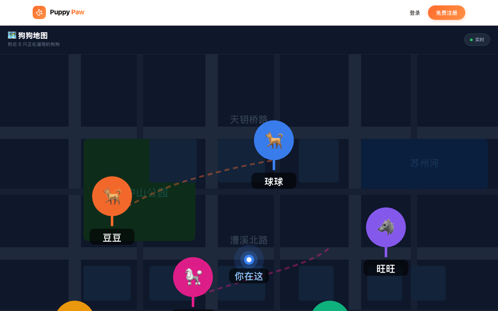

# 🐾 Puppy Paw

专业宠物遛狗平台 —— 连接宠物主与认证遛狗师，全程 GPS 追踪，安心又快乐。

[](https://puppypaw.vercel.app)


**线上体验：https://puppypaw.vercel.app**

## 截图预览

### 宠物主端

| 首页 | 多样化服务预约 |
|------|-------------|
|  |  |

| 遛狗师列表（信用排名） | GPS 实时追踪 |
|---------------------|------------|
|  |  |

| 服务评价 | 狗狗地图 |
|---------|---------|
|  |  |

### 遛狗师端

| 订单管理 | 附近抢单 |
|---------|---------|
|  |  |

| 信用档案 |
|---------|
|  |

---

## 使用说明

### 宠物主：预约遛狗

1. 打开首页，点击 **「我要找遛狗师」** 进入预约流程
2. **Step 1 — 选择服务**：选择日期、时长（30/60/90 分钟）、服务类型（普通 / 上门接送）
3. **Step 2 — 填写宠物信息**：录入宠物名字、品种、体重，说明特殊注意事项
4. **Step 3 — 选择遛狗师**：按距离 / 评分 / 价格筛选，查看遛狗师详情、历史评价
5. 确认下单后进入 **支付页**，费用由平台托管，服务完成后自动打款给遛狗师
6. 服务进行中可在 **实时追踪页** 查看 GPS 路线动画，通过内嵌聊天随时沟通
7. 服务结束后在 **评价页** 给出星级评分 + 快速标签 + 文字评价，评价提交后费用释放

### 宠物主：注册新账号

1. 点击导航栏 **「免费注册」** → 选择「我是宠物主」
2. **Step 1**：手机号 + 6 位 OTP 验证码（Demo 中输入任意 6 位即可）
3. **Step 2**：实名认证（姓名 + 身份证号）
4. **Step 3**：创建宠物档案（名字、品种、年龄、体重）
5. 注册完成后自动跳转首页

### 遛狗师：日常接单

1. 以遛狗师身份登录，进入 **遛狗师控制台**（`/walker`）
2. 顶部开关切换「接单中 / 休息中」状态
3. **待处理订单** 区域查看新订单，点击接受 → 出发 → 开始遛狗
4. 遛狗结束后提交 **服务报告**：路线截图 + 狗狗状态描述 + 照片
5. **收益中心** 实时查看本月已到账 / 托管中金额明细

### 遛狗师：注册与认证

1. 首页点击 **「我要接单赚钱」** 进入注册流程
2. **Step 1**：手机号 OTP 验证
3. **Step 2**：上传身份证正反面完成实名认证
4. **Step 3**：背景调查（Demo 中直接跳过）
5. **Step 4**：完成 10 道宠物知识题（满 80 分通过）
6. **Step 5**：填写个人简介、服务时段、服务半径（km）、定价

---

## 功能概览

### 宠物主端
| 功能 | 路由 |
|------|------|
| 首页与平台介绍 | `/` |
| 预约 Step 1：选日期和服务类型 | `/booking` |
| 预约 Step 2：填写宠物信息 | `/pet-info` |
| 预约 Step 3：浏览遛狗师列表 | `/walkers` |
| 遛狗师详情 + 下单支付 | `/owner` |
| 实时 GPS 路线追踪 + 内嵌聊天 | `/tracking` |
| 查看服务报告 + 评价遛狗师 | `/review` |
| 个人中心 | `/profile` |
| 注册（手机验证码 → 实名认证 → 宠物档案） | `/owner-register` |

### 遛狗师端
| 功能 | 路由 |
|------|------|
| 订单管理 + 收益中心 | `/walker` |
| 注册（5 步审核流程） | `/walker-register` |

## 核心业务流程

```
宠物主下单
  ├─ 选择遛狗师 → 填写日期 / 时间 / 交接方式
  ├─ 支付（费用托管至平台）
  ↓
服务进行中
  ├─ 宠物主：实时 GPS 地图追踪 + 聊天
  └─ 遛狗师：接单 → 开始 → 提交服务报告（路线 + 狗狗状态 + 照片）
  ↓
服务完成
  ├─ 宠物主确认报告 → 评价（星级 + 标签 + 文字）
  └─ 评价后费用自动释放给遛狗师
```

## 遛狗师注册审核流程

```
Step 1  手机号注册（6 格 OTP 验证码）
Step 2  实名认证（身份证号 + 正反面照片）
Step 3  背景调查（自费 ¥99 快速出结果 / 申请平台补贴）
Step 4  宠物知识测试（10 道单选题，≥ 80 分通过）
Step 5  账号激活（填写简介、服务时段、服务半径、定价、头像）
```

## 技术栈

| 类别 | 技术 |
|------|------|
| 框架 | React 19 + TypeScript 6 |
| 构建 | Vite 8 |
| 路由 | React Router v7 |
| 样式 | Tailwind CSS v4 + inline styles |
| 图标 | Lucide React |
| 状态 | React Context（AuthContext） |
| 数据 | 纯前端 Mock，无后端依赖 |

## 快速开始

```bash
# 安装依赖
npm install

# 启动开发服务器
npm run dev

# 构建生产版本
npm run build
```

开发服务器默认运行在 `http://localhost:5173`

## Demo 账号

| 角色 | 邮箱 | 密码 |
|------|------|------|
| 宠物主 | `owner@demo.com` | 任意 |
| 遛狗师 | `walker@demo.com` | 任意 |

> 真实注册的新账号数据从零开始；Demo 账号预置演示数据。

## 项目结构

```
src/
├── components/
│   ├── ChatWidget.tsx        # 浮动聊天窗口（订单页右下角）
│   └── Navbar.tsx            # 顶部导航栏
├── context/
│   └── AuthContext.tsx       # 全局登录状态
├── pages/
│   ├── LandingPage.tsx       # 首页
│   ├── AuthPage.tsx          # 登录 / 注册入口
│   ├── BookingPage.tsx       # 预约漏斗 Step 1
│   ├── PetInfoPage.tsx       # 预约漏斗 Step 2
│   ├── WalkerListPage.tsx    # 预约漏斗 Step 3（Rover 风格列表）
│   ├── OwnerPage.tsx         # 宠物主控制台（浏览 + 下单 + 支付）
│   ├── WalkerPage.tsx        # 遛狗师控制台（订单 + 收益 + 服务报告）
│   ├── TrackingPage.tsx      # SVG 实时 GPS 追踪地图
│   ├── ReviewPage.tsx        # 服务评价页
│   ├── ProfilePage.tsx       # 个人中心（信用分 + 宠物档案 + 历史订单）
│   ├── OwnerRegisterPage.tsx # 宠物主注册（3 步）
│   └── WalkerRegisterPage.tsx# 遛狗师注册（5 步审核）
├── types/
│   └── index.ts              # 全局类型定义
└── index.css                 # 全局样式与 CSS 动画
```

## 设计规范

| 元素 | 值 |
|------|-----|
| 主题色 | `#FF6B2C` |
| 页面背景 | `#F9F8F6` |
| 卡片背景 | `#FFFFFF` |
| 主标题色 | `#1A1A1A` |
| 正文色 | `#4A4A4A` |
| 辅助文字 | `#9B9B9B` |
| 卡片圆角 | `12px` / `16px` / `20px` |
| 卡片阴影 | `0 1px 3px rgba(0,0,0,0.06)` |

## License

MIT
